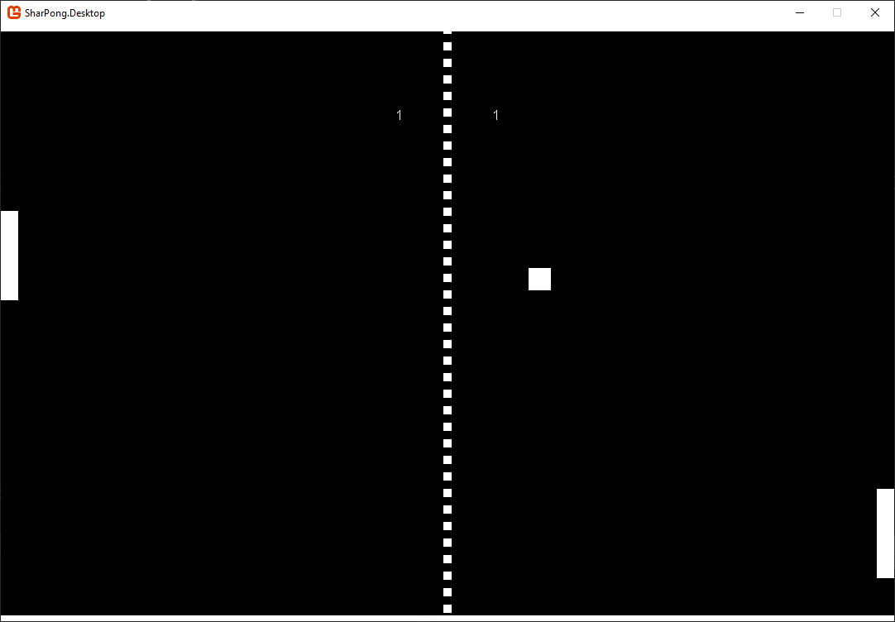

## About

This is a simple Pong clone built while in college a while ago in C# using Monogame. It was a fun little project to experiment with for the most part, though I found working with Visual Studio to be somewhat problematic.

## Demo

_If you wish to run the game follow the instructions for your platform in the [monogame website](https://docs.monogame.net/articles/getting_started/)._

Anyway, here’s the game in action:

